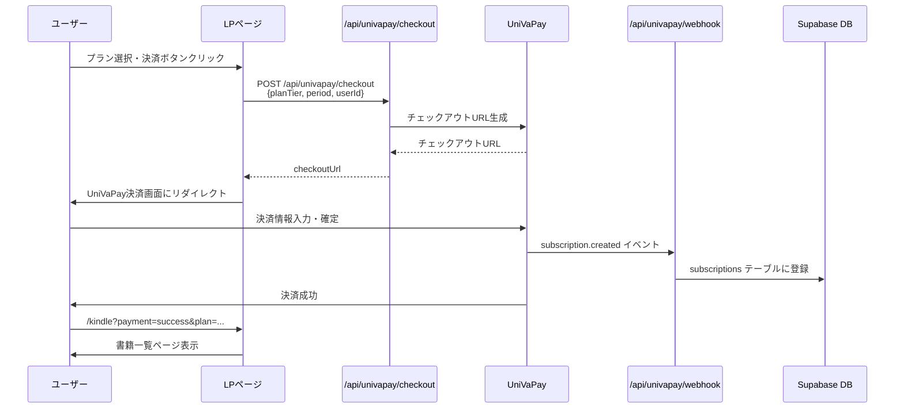

# KDL（キンドルダイレクトライト）ユーザーフロー

## 概要

KDL（キンドルダイレクトライト）は、AIを活用したKindle出版支援サービスです。このドキュメントでは、LPから課金、執筆までのユーザージャーニーとアクセス制御を説明します。

## ユーザージャーニー

```mermaid
flowchart TD
    Start([ユーザー]) --> LP[LPページ<br/>/kindle/lp]
    LP -->|プラン選択| Pricing[価格セクション<br/>/kindle/lp#pricing]
    Pricing -->|ログイン/会員登録| Auth{ログイン状態}
    Auth -->|未ログイン| Login[ログイン/会員登録]
    Login --> Payment[UniVaPay決済画面]
    Auth -->|ログイン済み| Payment
    Payment -->|決済成功| Success[/kindle?payment=success&plan=...]
    Payment -->|決済キャンセル| Cancel[/kindle/lp?payment=cancel]
    Success --> BookList[書籍一覧ページ<br/>/kindle]
    BookList -->|新規作成| NewBook[書籍作成<br/>/kindle/new]
    BookList -->|編集| EditBook[書籍編集<br/>/kindle/[id]]
    NewBook --> Wizard[執筆ウィザード<br/>テーマ入力→目次生成→執筆]
    EditBook --> Editor[エディター<br/>執筆・編集]
    Wizard --> Editor
    Editor --> PublishGuide[出版準備ガイド<br/>/kindle/publish-guide]
    
    style LP fill:#fef3c7
    style Payment fill:#fed7aa
    style BookList fill:#dbeafe
    style Editor fill:#e0e7ff
```

## URL遷移の詳細

| ステップ | URL | 説明 | 認証要件 |
|---------|-----|------|---------|
| **LP** | `/kindle/lp` | ランディングページ（サービス説明・価格） | 不要（公開） |
| **プラン選択** | `/kindle/lp#pricing` | LP内の価格セクション | 不要（公開） |
| **決済** | UniVaPay Hosted Checkout | 外部決済画面（UniVaPay） | 必要（決済前） |
| **決済成功** | `/kindle?payment=success&plan=monthly` | 書籍一覧ページにリダイレクト | 必要（ログイン済み） |
| **決済キャンセル** | `/kindle/lp?payment=cancel` | LPに戻る | 不要 |
| **書籍一覧** | `/kindle` | 作成済み書籍の一覧表示 | 必要（課金・モニター・管理者） |
| **書籍作成** | `/kindle/new` | 新規書籍作成ウィザード | 必要（課金・モニター・管理者） |
| **書籍編集** | `/kindle/[id]` | 書籍の編集画面 | 必要（課金・モニター・管理者） |
| **ガイド** | `/kindle/guide` | 使い方ガイド | 不要（公開） |
| **出版ガイド** | `/kindle/publish-guide` | 出版準備ガイド | 不要（公開） |

## アクセス制御

### middleware.ts のアクセス制御フロー

```mermaid
flowchart TD
    Request[/kindle配下へのアクセス] --> Public{公開パス?}
    Public -->|/kindle/lp, /kindle/guide等| Allow1[アクセス許可]
    Public -->|その他| AdminKey{admin_key<br/>パラメータ?}
    AdminKey -->|あり<br/>kdl-admin-2026| Allow2[アクセス許可<br/>管理者バイパス]
    AdminKey -->|なし| Auth{ログイン状態}
    Auth -->|未ログイン| Redirect1[/kindle/lpにリダイレクト]
    Auth -->|ログイン済み| Admin{管理者?}
    Admin -->|はい| Allow3[アクセス許可]
    Admin -->|いいえ| Monitor{モニター<br/>権限?}
    Monitor -->|有効期限内| Allow4[アクセス許可]
    Monitor -->|なし| Subscription{課金<br/>サブスク?}
    Subscription -->|有効| Allow5[アクセス許可]
    Subscription -->|無効| Redirect2[/kindle/lp#pricingにリダイレクト]
    
    style Allow2 fill:#fca5a5
    style Allow3 fill:#93c5fd
    style Allow4 fill:#c084fc
    style Allow5 fill:#86efac
    style Redirect2 fill:#fcd34d
```

### ユーザータイプ別のアクセス方法

| ユーザータイプ | URL | admin_key | 判定方法 | 備考 |
|-------------|-----|-----------|---------|------|
| **管理者** | `/kindle?admin_key=kdl-admin-2026` または `/kindle` | 付与（ダッシュボードの「書籍を管理する」から） | email判定（環境変数） | admin_keyなしでもアクセス可能（middlewareで管理者判定） |
| **モニター** | `/kindle` | **付与しない** | `monitor_users`テーブル | 有効期限内のみアクセス可能 |
| **課金ユーザー** | `/kindle` | **付与しない** | `kdl_subscriptions`テーブル | 有効なサブスクリプションが必要 |
| **未課金** | `/kindle/lp#pricing`（リダイレクト） | 付与しない | - | `/kindle`にアクセスするとLPにリダイレクト |

### アクセス制御の優先順位

1. **公開パス** - `/kindle/lp`, `/kindle/guide`, `/kindle/publish-guide`, `/kindle/demo` は認証不要
2. **管理者バイパス** - `?admin_key=kdl-admin-2026` パラメータ（管理者専用）
3. **管理者** - 環境変数で指定されたメールアドレス
4. **モニター** - `monitor_users`テーブルで有効期限内
5. **課金ユーザー** - `kdl_subscriptions`テーブルで有効なサブスクリプション
6. **未課金** - 上記以外は `/kindle/lp#pricing` にリダイレクト

## 決済フロー

### UniVaPay決済プロセス



### 決済後の処理

1. **UniVaPay Webhook** が `subscription.created` イベントを受信
2. `subscriptions` テーブルにサブスクリプション情報を登録
3. ユーザーは `/kindle?payment=success&plan=...` にリダイレクト
4. 書籍一覧ページでサブスクリプション状態が反映される

## 管理画面の仕様

### 管理者

- **アクセス方法**: 通常認証 + `admin_key` パラメータ（オプション）
- **特別機能**:
  - 全ユーザーの書籍を閲覧可能
  - プラン体験モード（各プランの機能をテスト）
  - デフォルトAIモデル設定
  - モニターユーザー管理

### モニターユーザー管理

管理者は特定のユーザーに期間限定で有料プラン機能を開放できます。

- **管理画面**: ダッシュボードの「モニターユーザー管理」セクション
- **設定項目**:
  - ユーザー選択
  - プランTier（lite, standard, pro, business）
  - 開始日時
  - 終了日時（有効期限）
- **効果**: モニターユーザーは有効期限内、指定されたプランの機能を利用可能

## セキュリティ上の注意事項

### admin_keyについて

- `admin_key=kdl-admin-2026` は**管理者専用**のバイパスキー
- 緊急時（セミナーなど）にmiddlewareの認証チェックをバイパスする用途
- **モニター・課金ユーザーには付与しない**（セキュリティリスク）
- モニター・課金ユーザーは通常の認証フローで問題なくアクセス可能

### URL パターンのまとめ

**書籍一覧ページ（/kindle）へのアクセス:**

| ユーザータイプ | URL | 説明 |
|-------------|-----|------|
| **課金ユーザー** | `/kindle` | admin_keyなし、通常の認証フロー |
| **モニターユーザー** | `/kindle` | admin_keyなし、通常の認証フロー |
| **管理者** | `/kindle?admin_key=kdl-admin-2026` | ダッシュボードの「書籍を管理する」から遷移（admin_key付与） |
| **管理者** | `/kindle` | ダッシュボードの「Kindle執筆」から遷移、または直接アクセス（admin_keyなしでもアクセス可能） |

### アクセス制御の実装

- **middleware.ts**: サーバーサイドでのアクセス制御
- **RLS（Row Level Security）**: Supabaseでデータベースレベルのアクセス制御
- ユーザーは自分の書籍のみアクセス可能（管理者を除く）

## 関連ファイル

- `middleware.ts` - アクセス制御のメインロジック
- `app/dashboard/page.tsx` - ダッシュボードからKDLへの遷移
- `app/kindle/page.tsx` - 書籍一覧ページ
- `app/kindle/new/page.tsx` - 書籍作成ページ
- `app/kindle/[id]/page.tsx` - 書籍編集ページ
- `app/kindle/lp/page.tsx` - ランディングページ
- `app/api/univapay/checkout/route.ts` - 決済処理
- `app/api/univapay/webhook/route.ts` - 決済完了処理
- `lib/subscription.ts` - サブスクリプション状態取得（モニター対応）

