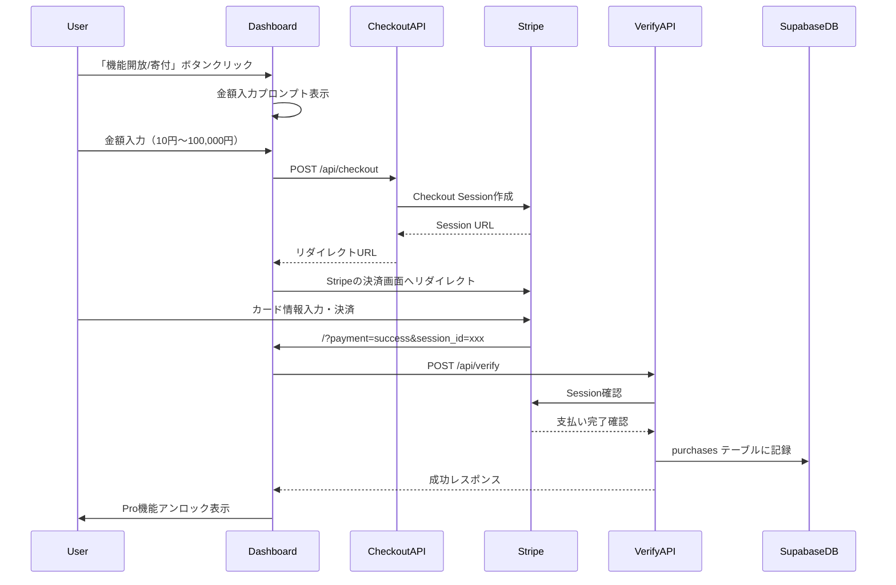

# 診断クイズメーカー プロジェクトアーキテクチャガイド

このドキュメントは「診断クイズメーカー」プロジェクトの構造を理解し、他プロジェクトに転用するための包括的なガイドです。

---

## 目次

1. [プロジェクト概要](#1-プロジェクト概要)
2. [技術スタック](#2-技術スタック)
3. [ディレクトリ構造](#3-ディレクトリ構造)
4. [主要コンポーネントの依存関係](#4-主要コンポーネントの依存関係)
5. [エディタ機能の詳細解説](#5-エディタ機能の詳細解説)
6. [アナリティクス機能の解説](#6-アナリティクス機能の解説)
7. [寄付（決済）機能の詳細解説](#7-寄付決済機能の詳細解説)
8. [認証システム](#8-認証システム)
9. [データベース設計](#9-データベース設計)
10. [転用時の設定項目](#10-転用時の設定項目)

---

## 1. プロジェクト概要

「診断クイズメーカー」は、ユーザーが診断クイズ・テスト・占いを作成・公開できるWebアプリケーションです。

### 主な機能
- **クイズ作成エディタ**: 4ステップウィザード形式で診断クイズを作成
- **3つのモード**: 診断（ビジネス）、テスト（学習）、占い（ランダム）
- **AI自動生成**: OpenAI APIを使用したクイズ自動生成
- **テンプレート**: 用途別プリセットで素早く作成
- **アナリティクス**: 閲覧数・完了数・クリック数の計測
- **寄付/決済**: Stripe連携でPro機能アンロック
- **HTML出力**: スタンドアロンで動作するHTMLファイル生成
- **お知らせ管理**: 管理者によるお知らせ投稿機能

---

## 2. 技術スタック

| 技術 | バージョン | 用途 |
|------|-----------|------|
| **Next.js** | 16.x | フレームワーク（App Router） |
| **React** | 19.x | UIライブラリ |
| **Supabase** | 2.89.x | データベース、認証、ストレージ |
| **Stripe** | 20.x | 決済処理 |
| **Tailwind CSS** | 4.x | スタイリング |
| **Recharts** | 3.6.x | グラフ描画（アナリティクス） |
| **OpenAI** | 6.x | AI生成機能 |
| **Lucide React** | 0.555.x | アイコン |
| **canvas-confetti** | 1.9.x | 紙吹雪エフェクト |

### package.json 依存関係

```json
{
  "dependencies": {
    "@supabase/supabase-js": "^2.89.0",
    "@stripe/stripe-js": "^8.6.0",
    "stripe": "^20.1.0",
    "openai": "^6.15.0",
    "next": "^16.0.7",
    "react": "^19.2.1",
    "recharts": "^3.6.0",
    "lucide-react": "^0.555.0",
    "canvas-confetti": "^1.9.4"
  }
}
```

---

## 3. ディレクトリ構造

```
my-diagnosis-app/
├── app/                          # Next.js App Router
│   ├── page.jsx                  # メインアプリケーション（SPA的構造）
│   ├── layout.tsx                # ルートレイアウト
│   ├── globals.css               # グローバルスタイル
│   ├── api/                      # APIルート
│   │   ├── checkout/route.js     # Stripe決済セッション作成
│   │   ├── verify/route.js       # 決済検証・購入記録
│   │   ├── generate-quiz/route.js # AI生成API
│   │   └── upload-html/route.js  # HTMLアップロード（オプション）
│   ├── dashboard/page.jsx        # マイページ（リダイレクト用）
│   ├── editor/page.jsx           # エディタ（リダイレクト用）
│   ├── announcements/page.jsx    # お知らせページ
│   └── [各静的ページ]/           # FAQ, 利用規約等
│
├── components/                   # Reactコンポーネント
│   ├── Editor.jsx                # クイズ作成エディタ（1526行）
│   ├── Dashboard.jsx             # マイページ・アナリティクス
│   ├── QuizPlayer.jsx            # クイズプレイヤー
│   ├── Portal.jsx                # トップページ
│   ├── AuthModal.jsx             # 認証モーダル
│   ├── Header.jsx                # 共通ヘッダー
│   ├── Footer.jsx                # 共通フッター
│   ├── AnnouncementBanner.jsx    # お知らせバナー
│   ├── SEO.jsx                   # SEOメタタグ
│   └── StaticPages.jsx           # 静的ページコンポーネント群
│
├── lib/                          # ユーティリティ・設定
│   ├── supabase.js               # Supabaseクライアント（クライアント用）
│   ├── supabaseClient.js         # Supabaseクライアント（別設定）
│   ├── htmlGenerator.js          # スタンドアロンHTML生成
│   ├── utils.js                  # 結果計算ロジック、Slug生成
│   └── constants.js              # 定数（管理者メール取得）
│
├── public/                       # 静的ファイル
│   └── robots.txt
│
└── supabase_*.sql                # データベーススキーマ
```

---

## 4. 主要コンポーネントの依存関係

```mermaid
graph TD
    subgraph AppRouter[App Router]
        PageJsx[app/page.jsx]
    end

    subgraph Components[コンポーネント]
        Portal[Portal.jsx]
        Editor[Editor.jsx]
        Dashboard[Dashboard.jsx]
        QuizPlayer[QuizPlayer.jsx]
        AuthModal[AuthModal.jsx]
    end

    subgraph APIs[API Routes]
        Checkout[/api/checkout]
        Verify[/api/verify]
        GenerateQuiz[/api/generate-quiz]
    end

    subgraph Lib[ライブラリ]
        Supabase[lib/supabase.js]
        Utils[lib/utils.js]
        HtmlGen[lib/htmlGenerator.js]
    end

    subgraph External[外部サービス]
        SupabaseDB[(Supabase)]
        StripeAPI[Stripe API]
        OpenAI[OpenAI API]
    end

    PageJsx --> Portal
    PageJsx --> Editor
    PageJsx --> Dashboard
    PageJsx --> QuizPlayer
    PageJsx --> AuthModal

    Portal --> Supabase
    Editor --> Supabase
    Editor --> GenerateQuiz
    Dashboard --> Supabase
    Dashboard --> Checkout
    Dashboard --> Verify
    Dashboard --> HtmlGen
    QuizPlayer --> Supabase
    QuizPlayer --> Utils
    AuthModal --> Supabase

    Checkout --> StripeAPI
    Verify --> StripeAPI
    Verify --> SupabaseDB
    GenerateQuiz --> OpenAI
```

### app/page.jsx の役割

このファイルがアプリケーション全体のルーティングとステート管理を担当しています。

```javascript
// app/page.jsx の主要な状態管理
const [view, setView] = useState('loading');  // 現在の画面
const [selectedQuiz, setSelectedQuiz] = useState(null);  // 選択中のクイズ
const [editingQuiz, setEditingQuiz] = useState(null);  // 編集中のクイズ
const [user, setUser] = useState(null);  // ログインユーザー
const [showAuth, setShowAuth] = useState(false);  // 認証モーダル表示

// 画面遷移ハンドラ
const navigateTo = async (newView, params = {}) => {
    // URLを更新しつつビューを切り替え
    window.history.pushState({ view: newView, ...params }, '', url);
    setView(newView);
};
```

---

## 5. エディタ機能の詳細解説

### 5.1 エディタの構造（components/Editor.jsx）

エディタは4ステップのウィザード形式で構成されています：

| ステップ | 内容 | 主な設定項目 |
|---------|------|-------------|
| **Step 1** | クイズの種類選択 | モード選択、テンプレート選択、AI生成 |
| **Step 2** | 基本設定 | タイトル、説明、レイアウト、画像 |
| **Step 3** | 質問作成 | 質問文、選択肢、スコア配分 |
| **Step 4** | 結果ページ | 結果タイトル、説明、誘導リンク |

### 5.2 3つのクイズモード

```javascript
// モード切替時の処理
const switchMode = (newMode) => {
    let newResults = form.results;
    let newCategory = "Business";

    if (newMode === 'test') {
        // テストモード: 正解/不正解形式
        newCategory = "Education";
        newResults = [
            { type: "A", title: "満点！天才！", description: "全問正解です。" },
            { type: "B", title: "あと少し！", description: "惜しい..." },
            { type: "C", title: "頑張ろう", description: "復習しましょう。" }
        ];
    } else if (newMode === 'fortune') {
        // 占いモード: ランダム結果
        newCategory = "Fortune";
        newResults = [
            { type: "A", title: "大吉", description: "最高の運勢！" },
            { type: "B", title: "中吉", description: "良いことがあるかも。" },
            { type: "C", title: "吉", description: "平凡こそ幸せ。" }
        ];
    } else {
        // 診断モード: ポイント加算方式
        newCategory = "Business";
        // 結果はタイプA/B/Cで分類
    }
    setForm({ ...form, mode: newMode, category: newCategory, results: newResults });
};
```

### 5.3 テンプレートシステム

#### 用途別テンプレート（USE_CASE_PRESETS）

```javascript
const USE_CASE_PRESETS = {
    kindle: {
        title: "あなたの著者タイプ診断",
        description: "Kindle出版に向いている執筆スタイルを診断",
        mode: "diagnosis",
        category: "Business",
        color: "bg-amber-600",
        questions: [...],
        results: [...]
    },
    instructor: { /* 講師向け */ },
    store: { /* 店舗向け */ },
    consultant: { /* コンサル向け */ }
};
```

#### カテゴリ別テンプレート（PRESETS）

```javascript
const PRESETS = {
    business: [
        { label: "起業家タイプ診断", data: {...} },
        { label: "SNS発信力レベル診断", data: {...} },
        { label: "副業適性チェック", data: {...} }
    ],
    education: [
        { label: "確定申告「経費」クイズ", data: {...} },
        { label: "中学英語「前置詞」", data: {...} }
    ],
    fortune: [
        { label: "今日の「推し活」運勢", data: {...} },
        { label: "あなたの「オーラカラー」", data: {...} }
    ]
};
```

### 5.4 AI自動生成機能

#### フロントエンド（Editor.jsx）

```javascript
const handleAiGenerate = async () => {
    if(!aiTheme) return alert('テーマを入力してください');
    setIsGenerating(true);
    try {
        const res = await fetch("/api/generate-quiz", {
            method: "POST",
            headers: { "Content-Type": "application/json" },
            body: JSON.stringify({ 
                theme: aiTheme,
                mode: form.mode,
                resultTypes: form.results.map(r => r.type) // A, B, C
            })
        });
        const { data: json } = await res.json();
        setForm(prev => ({ ...prev, ...json }));
    } catch(e) { 
        alert('AI生成エラー: ' + e.message); 
    } finally { 
        setIsGenerating(false); 
    }
};
```

#### バックエンド（app/api/generate-quiz/route.js）

```javascript
export async function POST(request) {
    const { theme, mode, resultTypes } = await request.json();
    
    // APIキー取得（診断クイズ専用キーを優先）
    const apiKey = process.env.OPENAI_API_KEY_QUIZ || process.env.OPENAI_API_KEY;
    
    // プロンプト生成（モードに応じて変更）
    let prompt = "";
    if (mode === 'test') {
        prompt = `テーマ「${theme}」の4択学習クイズを作成して...`;
    } else if (mode === 'fortune') {
        prompt = `テーマ「${theme}」の占いを作成して...`;
    } else {
        prompt = `テーマ「${theme}」の性格/タイプ診断を作成して...`;
    }
    
    // OpenAI API呼び出し
    const response = await fetch("https://api.openai.com/v1/chat/completions", {
        method: "POST",
        headers: {
            "Authorization": `Bearer ${apiKey}`
        },
        body: JSON.stringify({
            model: "gpt-3.5-turbo",
            messages: [{ role: "user", content: prompt + " 出力はJSON形式のみ" }]
        })
    });
    
    const data = await response.json();
    const json = JSON.parse(data.choices[0].message.content);
    return NextResponse.json({ success: true, data: json });
}
```

### 5.5 画像アップロード（Supabase Storage）

```javascript
const handleImageUpload = async (e) => {
    const file = e.target.files[0];
    if (!file || !supabase) return;

    setIsUploading(true);
    try {
        const fileExt = file.name.split('.').pop();
        const fileName = `${Math.random()}.${fileExt}`;
        const filePath = `${user?.id || 'anonymous'}/${fileName}`;

        // Supabase Storageにアップロード
        const { error } = await supabase.storage
            .from('quiz-thumbnails')
            .upload(filePath, file);
        if (error) throw error;

        // 公開URLを取得
        const { data } = supabase.storage
            .from('quiz-thumbnails')
            .getPublicUrl(filePath);
        
        setForm({ ...form, image_url: data.publicUrl });
    } catch (error) {
        alert('アップロードエラー: ' + error.message);
    } finally {
        setIsUploading(false);
    }
};
```

### 5.6 結果計算ロジック（lib/utils.js）

```javascript
export const calculateResult = (answers, results, mode = 'diagnosis') => {
    // 1. テストモード: 正解数でランク判定
    if (mode === 'test') {
        let correctCount = 0;
        Object.values(answers).forEach(option => {
            if (option.score && option.score.A === 1) correctCount++;
        });
        const ratio = correctCount / Object.keys(answers).length;
        let resultIndex = Math.floor((1 - ratio) * results.length);
        if (ratio === 1) resultIndex = 0;
        return { ...results[resultIndex], score: correctCount, total: Object.keys(answers).length };
    }

    // 2. 占いモード: 完全ランダム
    if (mode === 'fortune') {
        return results[Math.floor(Math.random() * results.length)];
    }

    // 3. 診断モード: ポイント加算方式
    const scores = { A: 0, B: 0, C: 0 };
    Object.values(answers).forEach(option => {
        if (option.score) {
            Object.entries(option.score).forEach(([type, point]) => {
                scores[type] = (scores[type] || 0) + parseInt(point, 10);
            });
        }
    });
    // 最高スコアのタイプを取得
    let maxType = 'A', maxScore = -1;
    Object.entries(scores).forEach(([type, score]) => {
        if (score > maxScore) { maxScore = score; maxType = type; }
    });
    return results.find(r => r.type === maxType) || results[0];
};
```

---

## 6. アナリティクス機能の解説

### 6.1 統計カウンター

クイズには4種類のカウンターがあります：

| カウンター | 説明 | 発火タイミング |
|-----------|------|--------------|
| `views_count` | 閲覧数 | クイズプレイヤー表示時 |
| `completions_count` | 完了数 | 結果表示時 |
| `clicks_count` | クリック数 | 結果ページのリンククリック時 |
| `likes_count` | いいね数 | いいねボタン押下時 |

### 6.2 Supabase RPC関数

Supabaseに以下のRPC関数を作成する必要があります：

```sql
-- 閲覧数を1増加
CREATE OR REPLACE FUNCTION increment_views(row_id BIGINT)
RETURNS VOID AS $$
BEGIN
    UPDATE quizzes SET views_count = COALESCE(views_count, 0) + 1 WHERE id = row_id;
END;
$$ LANGUAGE plpgsql;

-- 完了数を1増加
CREATE OR REPLACE FUNCTION increment_completions(row_id BIGINT)
RETURNS VOID AS $$
BEGIN
    UPDATE quizzes SET completions_count = COALESCE(completions_count, 0) + 1 WHERE id = row_id;
END;
$$ LANGUAGE plpgsql;

-- クリック数を1増加
CREATE OR REPLACE FUNCTION increment_clicks(row_id BIGINT)
RETURNS VOID AS $$
BEGIN
    UPDATE quizzes SET clicks_count = COALESCE(clicks_count, 0) + 1 WHERE id = row_id;
END;
$$ LANGUAGE plpgsql;

-- いいね数を1増加
CREATE OR REPLACE FUNCTION increment_likes(row_id BIGINT)
RETURNS VOID AS $$
BEGIN
    UPDATE quizzes SET likes_count = COALESCE(likes_count, 0) + 1 WHERE id = row_id;
END;
$$ LANGUAGE plpgsql;
```

### 6.3 カウンターの呼び出し箇所

#### QuizPlayer.jsx

```javascript
// 閲覧数カウント（クイズ開始時）
useEffect(() => {
    if(supabase) {
        supabase.rpc('increment_views', { row_id: quiz.id })
            .then(({error}) => error && console.error(error));
    }
    // ...
}, []);

// 完了数カウント（結果表示前）
const showResultOrEmail = async (finalAnswers) => {
    if(supabase) {
        await supabase.rpc('increment_completions', { row_id: quiz.id });
    }
    // 結果表示またはメールフォーム表示
};

// クリック数カウント（結果ページのリンククリック時）
const handleLinkClick = async () => {
    if(supabase) await supabase.rpc('increment_clicks', { row_id: quiz.id });
};
```

#### Portal.jsx

```javascript
// いいねカウント
const handleLike = async (e, quizId) => {
    e.stopPropagation();
    
    // 即座にUIを更新（楽観的更新）
    setLocalQuizzes(prev => prev.map(q => 
        q.id === quizId 
            ? { ...q, likes_count: (q.likes_count || 0) + 1 } 
            : q
    ));

    // バックグラウンドでDBを更新
    if(supabase) {
        await supabase.rpc('increment_likes', { row_id: quizId });
    }
};
```

### 6.4 ダッシュボードでのグラフ表示（Recharts）

```javascript
// Dashboard.jsx
import { BarChart, Bar, XAxis, YAxis, CartesianGrid, Tooltip, Legend, ResponsiveContainer } from 'recharts';

// グラフデータの生成
const graphData = myQuizzes.map(q => ({
    name: q.title.length > 10 ? q.title.substring(0, 10)+'...' : q.title,
    views: q.views_count || 0,
    completions: q.completions_count || 0,
    clicks: q.clicks_count || 0
}));

// グラフ表示
<ResponsiveContainer width="100%" height="100%">
    <BarChart data={graphData}>
        <CartesianGrid strokeDasharray="3 3" vertical={false} />
        <XAxis dataKey="name" tick={{fontSize: 10}} />
        <YAxis />
        <Tooltip />
        <Legend />
        <Bar dataKey="views" name="閲覧数" fill="#6366f1" />
        <Bar dataKey="completions" name="完了数" fill="#f59e0b" />
        <Bar dataKey="clicks" name="クリック" fill="#10b981" />
    </BarChart>
</ResponsiveContainer>
```

### 6.5 完了率・CTR計算

```javascript
// テーブル表示時の計算
{myQuizzes.map(q => {
    // 完了率 = 完了数 / 閲覧数 * 100
    const rate = q.views_count > 0 
        ? Math.round((q.completions_count || 0) / q.views_count * 100) 
        : 0;
    
    // CTR = クリック数 / 完了数 * 100
    const ctr = q.completions_count > 0 
        ? Math.round((q.clicks_count || 0) / q.completions_count * 100) 
        : 0;
    
    return (
        <tr>
            <td>{q.title}</td>
            <td>{q.views_count || 0}</td>
            <td>{q.completions_count || 0}</td>
            <td>{rate}%</td>
            <td>{q.clicks_count || 0}</td>
            <td>{ctr}%</td>
        </tr>
    );
})}
```

---

## 7. 寄付（決済）機能の詳細解説

### 7.1 決済フロー概要



### 7.2 決済セッション作成（app/api/checkout/route.js）

```javascript
import { NextResponse } from 'next/server';
import Stripe from 'stripe';

const stripe = new Stripe(process.env.STRIPE_SECRET_KEY);

export async function POST(req) {
    try {
        const { quizId, quizTitle, userId, email, price } = await req.json();
        
        // 価格バリデーション（10円〜100,000円）
        let finalPrice = parseInt(price);
        if (isNaN(finalPrice) || finalPrice < 10 || finalPrice > 100000) {
            finalPrice = 1000;
        }

        // オリジン取得
        let origin = req.headers.get('origin') || req.headers.get('referer');
        if (origin) origin = new URL(origin).origin;

        // Stripe Checkout Session作成
        const session = await stripe.checkout.sessions.create({
            payment_method_types: ['card'],
            line_items: [{
                price_data: {
                    currency: 'jpy',
                    product_data: {
                        name: `HTMLデータ提供: ${quizTitle}`,
                        description: '診断クイズのHTMLデータ（寄付・応援）',
                    },
                    unit_amount: finalPrice,
                },
                quantity: 1,
            }],
            mode: 'payment',
            // 成功時のリダイレクト先（URLパラメータで情報を渡す）
            success_url: `${origin}/?payment=success&session_id={CHECKOUT_SESSION_ID}&quiz_id=${quizId}&redirect=dashboard`,
            cancel_url: `${origin}/?payment=cancel&redirect=dashboard`,
            metadata: {
                userId: userId,
                quizId: quizId,
            },
            customer_email: email,
        });

        return NextResponse.json({ url: session.url });
    } catch (err) {
        return NextResponse.json({ error: err.message }, { status: 500 });
    }
}
```

### 7.3 決済検証・購入記録（app/api/verify/route.js）

```javascript
import { NextResponse } from 'next/server';
import Stripe from 'stripe';
import { createClient } from '@supabase/supabase-js';

const stripe = new Stripe(process.env.STRIPE_SECRET_KEY);

// ★重要: サービスロールキーでSupabaseに接続（RLSをバイパス）
const supabaseAdmin = createClient(
    process.env.NEXT_PUBLIC_SUPABASE_URL,
    process.env.SUPABASE_SERVICE_ROLE_KEY
);

export async function POST(req) {
    try {
        const { sessionId, quizId, userId } = await req.json();

        // 1. Stripeで支払い状況を確認
        const session = await stripe.checkout.sessions.retrieve(sessionId);
        if (session.payment_status !== 'paid') {
            return NextResponse.json(
                { error: 'Payment not completed' }, 
                { status: 400 }
            );
        }

        // 2. 重複チェック（同じsession_idで既に記録されていないか）
        const { data: existing } = await supabaseAdmin
            .from('purchases')
            .select('id')
            .eq('stripe_session_id', sessionId)
            .single();

        if (existing) {
            return NextResponse.json({ success: true, message: 'Already recorded' });
        }

        // 3. 購入履歴を記録
        const { data, error } = await supabaseAdmin
            .from('purchases')
            .insert([{
                user_id: userId,
                quiz_id: parseInt(quizId),
                stripe_session_id: sessionId,
                amount: session.amount_total
            }])
            .select();

        if (error) throw error;

        return NextResponse.json({ success: true, data });
    } catch (err) {
        return NextResponse.json({ error: err.message }, { status: 500 });
    }
}
```

### 7.4 ダッシュボードでの決済処理（Dashboard.jsx）

#### 決済開始

```javascript
const handlePurchase = async (quiz) => {
    // 金額入力ダイアログ
    const inputPrice = window.prompt(
        `「${quiz.title}」のPro機能を開放します。\n応援・寄付金額を入力してください（10円〜100,000円）。`, 
        "1000"
    );
    if (inputPrice === null) return;
    
    const price = parseInt(inputPrice, 10);
    if (isNaN(price) || price < 10 || price > 100000) {
        alert("金額は 10円以上、100,000円以下 で入力してください。");
        return;
    }

    setProcessingId(quiz.id);
    try {
        const res = await fetch('/api/checkout', {
            method: 'POST',
            headers: { 'Content-Type': 'application/json' },
            body: JSON.stringify({
                quizId: quiz.id,
                quizTitle: quiz.title,
                userId: user.id,
                email: user.email,
                price: price
            }),
        });
        const data = await res.json();
        if (data.url) {
            window.location.href = data.url;  // Stripeへリダイレクト
        }
    } catch (e) {
        alert('エラー: ' + e.message);
        setProcessingId(null);
    }
};
```

#### 決済成功後の検証（useEffect内）

```javascript
useEffect(() => {
    const init = async () => {
        const params = new URLSearchParams(window.location.search);
        const paymentStatus = params.get('payment');
        const sessionId = params.get('session_id');
        const quizId = params.get('quiz_id');
        
        if (paymentStatus === 'success' && sessionId && user) {
            // 決済検証APIを呼び出し
            await verifyPayment(sessionId, quizId);
        }
        // ...
    };
    init();
}, [user]);

const verifyPayment = async (sessionId, quizId) => {
    const res = await fetch('/api/verify', {
        method: 'POST',
        headers: { 'Content-Type': 'application/json' },
        body: JSON.stringify({ sessionId, quizId, userId: user.id }),
    });
    
    if (res.ok) {
        // URLパラメータをクリア
        window.history.replaceState(null, '', window.location.pathname);
        
        // 購入履歴を再取得
        const { data: bought } = await supabase
            .from('purchases')
            .select('quiz_id')
            .eq('user_id', user.id);
        
        setPurchases(bought?.map(p => p.quiz_id) || []);
        
        alert('寄付ありがとうございます！Pro機能が開放されました。');
        window.location.href = '/dashboard';
    }
};
```

### 7.5 Pro機能のアンロック判定

```javascript
// Dashboard.jsx
{myQuizzes.map(quiz => {
    // 購入済み または 管理者ならアンロック
    const isUnlocked = purchases.includes(quiz.id) || isAdmin;
    
    return (
        <div>
            {/* アンロック済みならHTMLダウンロード可能 */}
            {isUnlocked ? (
                <button onClick={() => handleDownload(quiz)}>
                    HTMLダウンロード
                </button>
            ) : (
                <button onClick={() => handlePurchase(quiz)}>
                    機能開放 / 寄付
                </button>
            )}
            
            {/* 埋め込みコードもアンロック必要 */}
            <button 
                onClick={() => handleEmbed(quiz, isUnlocked)}
                disabled={!isUnlocked}
            >
                埋め込み
            </button>
            
            {/* リード取得もアンロック必要 */}
            {quiz.collect_email && (
                <button 
                    onClick={() => handleDownloadLeads(quiz, isUnlocked)}
                    disabled={!isUnlocked}
                >
                    アドレス帳(CSV)
                </button>
            )}
        </div>
    );
})}
```

### 7.6 HTMLダウンロード機能

```javascript
const handleDownload = (quiz) => {
    const htmlContent = generateQuizHTML(quiz);
    const blob = new Blob([htmlContent], { type: 'text/html' });
    const url = URL.createObjectURL(blob);
    const a = document.createElement('a');
    a.href = url;
    a.download = `${quiz.title || 'quiz'}.html`;
    document.body.appendChild(a);
    a.click();
    document.body.removeChild(a);
    URL.revokeObjectURL(url);
};
```

---

## 8. 認証システム

### 8.1 Supabase Authの設定

```javascript
// lib/supabase.js
import { createClient } from '@supabase/supabase-js';

const supabaseUrl = process.env.NEXT_PUBLIC_SUPABASE_URL;
const supabaseAnonKey = process.env.NEXT_PUBLIC_SUPABASE_ANON_KEY;

export const supabase = (supabaseUrl && supabaseAnonKey) 
    ? createClient(supabaseUrl, supabaseAnonKey, {
        auth: {
            autoRefreshToken: true,
            persistSession: true,
            detectSessionInUrl: true,  // URLハッシュからセッション自動検出
            flowType: 'pkce',          // PKCE形式を有効化
        }
    }) 
    : null;
```

### 8.2 認証モーダル（AuthModal.jsx）

#### ログイン/新規登録

```javascript
const handleAuth = async (e) => {
    e.preventDefault();
    setLoading(true);
    try {
        const { data, error } = isLogin 
            ? await supabase.auth.signInWithPassword({ email, password })
            : await supabase.auth.signUp({ 
                email, 
                password,
                options: { 
                    emailRedirectTo: window.location.origin 
                }
            });
        
        if (error) {
            // 重複メールアドレスの特別処理
            if (!isLogin && error.message.includes('already registered')) {
                // 自動的にログインを試行
                const { data: loginData } = await supabase.auth.signInWithPassword({ 
                    email, password 
                });
                if (loginData.user) {
                    alert('既に登録済みです。自動的にログインしました。');
                    setUser(loginData.user);
                    onClose();
                    return;
                }
            }
            throw error;
        }
        
        if (data.user) {
            setUser(data.user);
            onClose();
            onNavigate('dashboard');
        }
    } catch (e) {
        alert('エラー: ' + e.message);
    } finally {
        setLoading(false);
    }
};
```

#### パスワードリセット

```javascript
const handlePasswordReset = async (e) => {
    e.preventDefault();
    if (!email) return alert('メールアドレスを入力してください');
    
    setLoading(true);
    try {
        const redirectUrl = `${window.location.origin}`;
        
        await supabase.auth.resetPasswordForEmail(email, {
            redirectTo: redirectUrl,
        });
        
        setResetSent(true);
        setResendCountdown(60);  // 60秒後に再送信可能
    } catch (e) {
        console.error('Password reset error:', e);
    } finally {
        setLoading(false);
    }
};
```

#### パスワード変更（リセットリンクから来た場合）

```javascript
const handlePasswordChange = async (e) => {
    e.preventDefault();
    if (newPassword !== confirmPassword) {
        return alert('パスワードが一致しません');
    }
    if (newPassword.length < 6) {
        return alert('パスワードは6文字以上で入力してください');
    }
    
    setLoading(true);
    try {
        const { error } = await supabase.auth.updateUser({
            password: newPassword
        });
        
        if (error) throw error;
        
        alert('パスワードを変更しました');
        onClose();
        onNavigate('dashboard');
    } catch (e) {
        alert('エラー: ' + e.message);
    } finally {
        setLoading(false);
    }
};
```

### 8.3 管理者判定

```javascript
// lib/constants.js
export const getAdminEmails = () => {
    // 環境変数からカンマ区切りで複数メール取得
    return (process.env.NEXT_PUBLIC_ADMIN_EMAILS || '')
        .split(',')
        .map(e => e.trim())
        .filter(Boolean);
};

// app/page.jsx での使用
const adminEmails = getAdminEmails();
const isAdmin = user?.email && adminEmails.some(email => 
    user.email.toLowerCase() === email.toLowerCase()
);
```

### 8.4 パスワードリセットフロー（PKCE対応）

```javascript
// app/page.jsx 初期化時の処理
const init = async () => {
    const searchParams = new URLSearchParams(window.location.search);
    const tokenHash = searchParams.get('token_hash');
    const type = searchParams.get('type');
    
    // PKCE形式のtoken_hashがある場合
    if (tokenHash && type === 'recovery') {
        const { data, error } = await supabase.auth.verifyOtp({
            token_hash: tokenHash,
            type: 'recovery',
        });
        
        if (error) {
            alert('パスワードリセットリンクが無効または期限切れです');
            return;
        }
        
        if (data?.session?.user) {
            setUser(data.session.user);
            setShowPasswordReset(true);  // パスワード変更画面表示
            setShowAuth(true);
            // URLパラメータをクリア
            window.history.replaceState(null, '', window.location.pathname);
        }
    }
};
```

---

## 9. データベース設計

### 9.1 quizzes テーブル

```sql
CREATE TABLE public.quizzes (
    id BIGSERIAL PRIMARY KEY,
    user_id UUID REFERENCES auth.users(id) ON DELETE SET NULL,
    slug TEXT UNIQUE,                    -- 公開URL用のランダム文字列
    title TEXT NOT NULL,
    description TEXT,
    category TEXT,                       -- Business, Education, Fortune
    mode TEXT DEFAULT 'diagnosis',       -- diagnosis, test, fortune
    layout TEXT DEFAULT 'card',          -- card, chat
    color TEXT DEFAULT 'bg-indigo-600',
    image_url TEXT,
    collect_email BOOLEAN DEFAULT false, -- リード獲得機能
    questions JSONB,                     -- 質問配列
    results JSONB,                       -- 結果配列
    views_count INTEGER DEFAULT 0,
    completions_count INTEGER DEFAULT 0,
    clicks_count INTEGER DEFAULT 0,
    likes_count INTEGER DEFAULT 0,
    created_at TIMESTAMP WITH TIME ZONE DEFAULT NOW(),
    updated_at TIMESTAMP WITH TIME ZONE DEFAULT NOW()
);

-- インデックス
CREATE INDEX idx_quizzes_user_id ON quizzes(user_id);
CREATE INDEX idx_quizzes_slug ON quizzes(slug);
CREATE INDEX idx_quizzes_category ON quizzes(category);
```

### 9.2 questions JSON構造

```json
[
    {
        "text": "質問文",
        "options": [
            {
                "label": "選択肢1",
                "score": { "A": 3, "B": 0, "C": 0 }
            },
            {
                "label": "選択肢2",
                "score": { "A": 0, "B": 3, "C": 0 }
            }
        ]
    }
]
```

### 9.3 results JSON構造

```json
[
    {
        "type": "A",
        "title": "結果タイトル",
        "description": "結果の説明文",
        "link_url": "https://...",
        "link_text": "詳しく見る",
        "line_url": "https://line.me/...",
        "line_text": "LINEで相談",
        "qr_url": "https://...",
        "qr_text": "QRコードを表示"
    }
]
```

### 9.4 purchases テーブル

```sql
CREATE TABLE public.purchases (
    id BIGSERIAL PRIMARY KEY,
    user_id UUID NOT NULL REFERENCES auth.users(id) ON DELETE CASCADE,
    quiz_id BIGINT NOT NULL REFERENCES public.quizzes(id) ON DELETE CASCADE,
    stripe_session_id TEXT NOT NULL UNIQUE,
    amount INTEGER NOT NULL,
    created_at TIMESTAMP WITH TIME ZONE DEFAULT NOW()
);

-- インデックス
CREATE INDEX idx_purchases_user_id ON purchases(user_id);
CREATE INDEX idx_purchases_quiz_id ON purchases(quiz_id);

-- RLS有効化
ALTER TABLE purchases ENABLE ROW LEVEL SECURITY;

-- ユーザーは自分の購入履歴のみ閲覧可能
CREATE POLICY "Users can view their own purchases"
ON purchases FOR SELECT
USING (auth.uid() = user_id);

-- サービスロールは挿入可能
CREATE POLICY "Service role can insert purchases"
ON purchases FOR INSERT
WITH CHECK (true);
```

### 9.5 announcements テーブル

```sql
CREATE TABLE public.announcements (
    id BIGSERIAL PRIMARY KEY,
    title TEXT NOT NULL,
    content TEXT NOT NULL,
    link_url TEXT,
    link_text TEXT,
    is_active BOOLEAN DEFAULT true,
    announcement_date DATE,
    service_type TEXT DEFAULT 'all',  -- all, quiz, profile
    created_at TIMESTAMP WITH TIME ZONE DEFAULT NOW()
);
```

### 9.6 quiz_leads テーブル（リード獲得）

```sql
CREATE TABLE public.quiz_leads (
    id BIGSERIAL PRIMARY KEY,
    quiz_id BIGINT NOT NULL REFERENCES public.quizzes(id) ON DELETE CASCADE,
    email TEXT NOT NULL,
    created_at TIMESTAMP WITH TIME ZONE DEFAULT NOW()
);

CREATE INDEX idx_quiz_leads_quiz_id ON quiz_leads(quiz_id);
```

---

## 10. 転用時の設定項目

### 10.1 必要な環境変数

```env
# Supabase
NEXT_PUBLIC_SUPABASE_URL=https://xxxxx.supabase.co
NEXT_PUBLIC_SUPABASE_ANON_KEY=eyJhbGci...
SUPABASE_SERVICE_ROLE_KEY=eyJhbGci...  # 決済検証API用

# Stripe
STRIPE_SECRET_KEY=sk_live_...          # または sk_test_...

# OpenAI（AI生成機能用）
OPENAI_API_KEY=sk-...
OPENAI_API_KEY_QUIZ=sk-...             # オプション: 診断クイズ専用キー

# 管理者設定
NEXT_PUBLIC_ADMIN_EMAILS=admin@example.com,admin2@example.com
```

### 10.2 Supabase設定手順

1. **プロジェクト作成**
   - Supabaseダッシュボードで新規プロジェクト作成
   - プロジェクトURLとAnon Keyをコピー

2. **テーブル作成**
   - SQL Editorで上記のCREATE TABLE文を実行
   - RPC関数（increment_views等）を作成

3. **ストレージ設定**
   - `quiz-thumbnails` バケットを作成
   - 公開アクセスを許可（Publicに設定）

4. **認証設定**
   - Authentication > Settings > Site URL を設定
   - Email Templates でパスワードリセットメールをカスタマイズ

5. **RLS設定**
   - 各テーブルにRow Level Securityを設定

### 10.3 Stripe設定手順

1. **アカウント作成**
   - Stripe Dashboardでアカウント作成

2. **APIキー取得**
   - Developers > API keys からSecret Keyをコピー
   - テスト環境では `sk_test_...`、本番では `sk_live_...`

3. **Webhooks（オプション）**
   - 決済成功時の通知を受け取る場合は設定
   - 現在のアーキテクチャでは不要（成功時のリダイレクトで処理）

### 10.4 デプロイ手順（Vercel）

1. **GitHubリポジトリ接続**
   - Vercelダッシュボードで「Import Project」

2. **環境変数設定**
   - Settings > Environment Variables で上記の変数を設定

3. **ビルド設定**
   - Framework Preset: Next.js
   - Build Command: `next build`
   - Output Directory: `.next`

4. **ドメイン設定**
   - Settings > Domains でカスタムドメインを追加

### 10.5 転用時のカスタマイズポイント

| 項目 | ファイル | 変更内容 |
|------|----------|---------|
| サービス名 | 全体 | 「診断クイズメーカー」を新しい名前に |
| ロゴ・ブランドカラー | `globals.css`, 各コンポーネント | Tailwindのカラー設定 |
| テンプレート | `Editor.jsx` | USE_CASE_PRESETS, PRESETSを新しいものに |
| 決済説明文 | `checkout/route.js` | product_dataの内容 |
| 管理者メール | 環境変数 | NEXT_PUBLIC_ADMIN_EMAILS |
| OGP画像 | `app/api/og/` | 動的OGP画像生成 |
| アナリティクス | `layout.tsx`, `page.jsx` | Google Analyticsの設定 |

---

## 付録: よくある実装パターン

### A. ユニークSlug生成

```javascript
// lib/utils.js
export const generateSlug = () => {
    const chars = 'abcdefghijklmnopqrstuvwxyzABCDEFGHIJKLMNOPQRSTUVWXYZ0123456789';
    return Array.from({length: 5}, () => 
        chars[Math.floor(Math.random() * chars.length)]
    ).join('');
};
```

### B. スタンドアロンHTML生成

```javascript
// lib/htmlGenerator.js
export const generateQuizHTML = (quiz) => {
    const safeJson = (data) => JSON.stringify(data).replace(/</g, '\\u003c');
    
    return `<!DOCTYPE html>
<html lang="ja">
<head>
    <meta charset="UTF-8">
    <title>${quiz.title}</title>
    <style>/* インラインCSS */</style>
</head>
<body>
    <div id="app"><!-- クイズUI --></div>
    <script>
        const quizData = ${safeJson(quiz)};
        // クイズロジック（vanilla JS）
    </script>
</body>
</html>`;
};
```

### C. 楽観的UIアップデート

```javascript
// いいねボタンの例（Portal.jsx）
const handleLike = async (e, quizId) => {
    e.stopPropagation();
    
    // 1. 即座にUIを更新（ユーザーを待たせない）
    setLocalQuizzes(prev => prev.map(q => 
        q.id === quizId 
            ? { ...q, likes_count: (q.likes_count || 0) + 1 } 
            : q
    ));

    // 2. バックグラウンドでDBを更新
    await supabase.rpc('increment_likes', { row_id: quizId });
};
```

---

このドキュメントを参考に、「診断クイズメーカー」のアーキテクチャを他のプロジェクトに転用してください。特にエディタ機能、アナリティクス機能、決済機能は汎用性が高く、様々なSaaSプロジェクトに応用できます。

