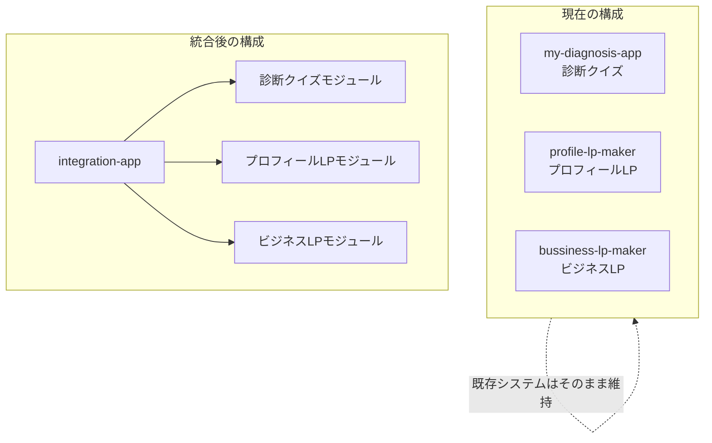

# 統合プロジェクト（integration-app）作成プラン

## 概要

3つの既存サービスを1つのNext.jsアプリケーションに統合し、統一されたエディタUIから診断クイズ・プロフィールLP・ビジネスLPを作成・管理できるシステムを構築します。

## 現状分析




## フォルダ構成案

```javascript
D:\obsidian\integration-app\
├── app/
│   ├── page.jsx                    # 統合ランディングページ
│   ├── layout.tsx
│   ├── globals.css
│   ├── dashboard/
│   │   └── page.tsx                # 統合ダッシュボード
│   ├── quiz/                       # 診断クイズ関連ルート
│   │   ├── editor/page.tsx
│   │   ├── [slug]/page.tsx
│   │   └── demo/page.tsx
│   ├── profile/                    # プロフィールLP関連ルート
│   │   ├── editor/page.tsx
│   │   └── [slug]/page.tsx
│   ├── business/                   # ビジネスLP関連ルート
│   │   ├── editor/page.tsx
│   │   └── [slug]/page.tsx
│   └── api/                        # 統合API
│       ├── checkout/
│       ├── generate-quiz/
│       ├── generate-profile/
│       └── generate-business/
├── components/
│   ├── shared/                     # 共通コンポーネント
│   │   ├── Header.tsx
│   │   ├── Footer.tsx
│   │   ├── AuthModal.tsx
│   │   ├── AnnouncementBanner.tsx
│   │   └── ServiceSelector.tsx     # サービス選択UI（新規）
│   ├── quiz/                       # 診断クイズ用
│   │   ├── QuizEditor.tsx
│   │   ├── QuizDashboard.tsx
│   │   └── QuizPlayer.tsx
│   ├── profile/                    # プロフィールLP用
│   │   ├── ProfileEditor.tsx
│   │   └── ProfileDashboard.tsx
│   └── business/                   # ビジネスLP用
│       ├── BusinessEditor.tsx
│       └── BusinessDashboard.tsx
├── lib/
│   ├── supabase.ts                 # 共通Supabaseクライアント
│   ├── utils.ts
│   ├── types.ts                    # 統合型定義
│   ├── quiz/                       # 診断クイズ用ライブラリ
│   │   └── htmlGenerator.ts
│   ├── profile/
│   │   └── htmlGenerator.ts
│   └── business/
│       └── htmlGenerator.ts
├── constants/
│   └── templates.ts                # 全サービスのテンプレート
├── package.json
└── .env.local.example
```

---

## 実装手順

### Phase 1: プロジェクト基盤の作成

1. **新規Next.jsプロジェクト作成**

- `D:\obsidian\integration-app` にプロジェクトを作成
- 全サービスの依存関係を統合した `package.json` を作成

2. **共通インフラの設定**

- Supabase、Stripe、OpenAI、Gemini の環境変数テンプレート作成
- 共通のTailwind CSS設定

### Phase 2: 共通コンポーネントの移植

3. **共通UIコンポーネント**

- Header, Footer, AuthModal を統合版として作成
- サービス選択コンポーネント（ServiceSelector）の新規作成

4. **共通ライブラリ**

- Supabaseクライアント（認証設定を統一）
- ユーティリティ関数の統合

### Phase 3: 各サービスモジュールの移植

5. **診断クイズモジュール**

- `my-diagnosis-app` から Editor.jsx, Dashboard.jsx, QuizPlayer.jsx を移植
- htmlGenerator.js を `lib/quiz/` に配置

6. **プロフィールLPモジュール**

- `profile-lp-maker` から ProfileEditor.tsx, ProfileDashboard.jsx を移植
- profileHtmlGenerator.ts を `lib/profile/` に配置

7. **ビジネスLPモジュール**

- `bussiness-lp-maker` から BusinessLPEditor.tsx, BusinessDashboard.tsx を移植
- AI Flyer機能（Gemini連携）も含めて移植

### Phase 4: 統合ダッシュボードとルーティング

8. **統合ダッシュボード**

- 3サービスを1つのダッシュボードで管理
- サービスタイプでフィルタリング可能なUI

9. **APIルートの統合**

- 決済、コンテンツ生成、検証の各APIを統合

### Phase 5: テストとドキュメント

10. **動作確認**

    - 各サービスの基本機能テスト
    - 認証フローの確認

---

## 安全性の確保

| 項目 | 対策 ||------|------|| 既存プロジェクトの保護 | 既存3プロジェクトには一切変更を加えない。新規フォルダにのみ作業 || 段階的な移行 | 各フェーズ完了後にコミット、問題があれば巻き戻し可能 || 環境変数 | `.env.local.example` を作成し、本番キーは手動で設定 || データベース | 新規テーブルは不要（既存Supabaseテーブルを共有利用） |---

## 主要な依存パッケージ（統合版）

```json
{
  "@google/generative-ai": "^0.24.1",
  "@sparticuz/chromium": "^143.0.0",
  "@stripe/stripe-js": "^8.5.3",
  "@supabase/ssr": "^0.8.0",
  "@supabase/supabase-js": "^2.86.0",
  "canvas-confetti": "^1.9.4",
  "lucide-react": "^0.555.0",
  "next": "^16.0.7",
  "openai": "^6.10.0",
  "puppeteer-core": "^24.33.0",
  "qrcode.react": "^4.2.0",
  "react": "^19.2.1",
  "react-dom": "^19.2.1",
  "recharts": "^3.5.1",
  "stripe": "^20.0.0"
}
```

---

## 注意事項